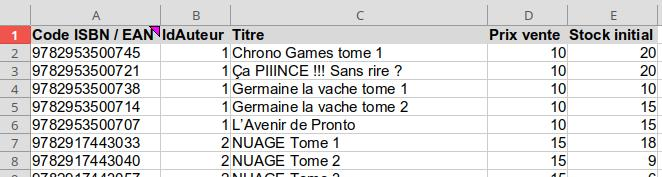
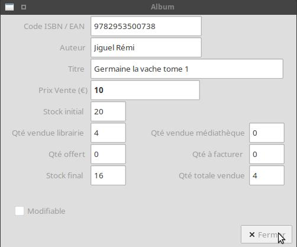
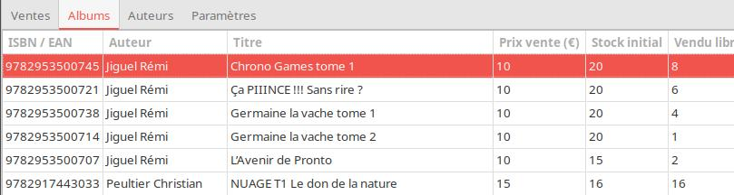
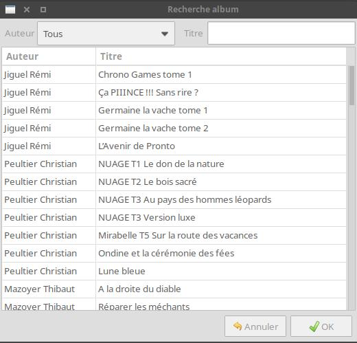
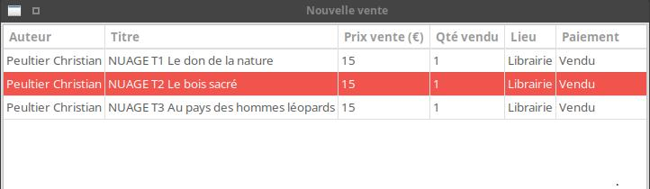
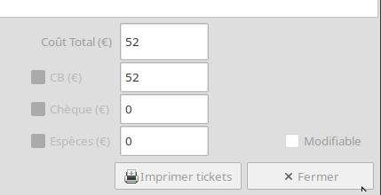
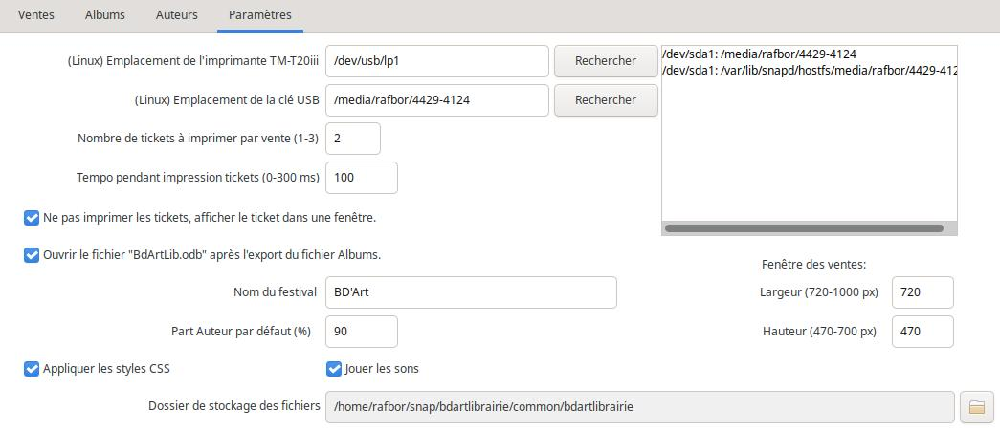

# BdArtLibrairie

## Présentation

Cette application a été créée pour gérer les ventes de la librairie tenue par des bénévoles lors du festival de bandes dessinées BD’Art de Rive de Gier (42800). Elle permet de réaliser les ventes en scannant les code-barres des albums, d'éditer des tickets de paiements, et de calculer les sommes à reverser aux auteurs en fin de festival.

Elle est composée de 4 onglets: _Ventes, Albums, Auteurs, Paramètres_.
Les données sont stockées dans 4 fichiers au format _csv_, séparateur _;_ (_Auteurs.csv_, _Albums.csv_, _Ventes.csv_ et _Paiements.csv_). Les fichiers sont stockés dans le sous-dossier _Fichiers_, situé dans le dossier de l’application.

## Principe de fonctionnement

On utilise le fichier de calcul _Modèle_librairie.ods_ dans un tableur pour d'abord créer la liste des auteurs et la liste des albums, puis générer les fichiers _csv_.
Renseigner l'onglet _Auteurs_:


(dans la colonne Pourcentage, indiquer la part en % à reverser à l’auteur après les ventes)

puis l'onglet _Albums_:



**Important**: les chiffres de la colonne _IdAuteur_ de l’onglet _Albums_, doivent correspondre à ceux de la colonne _IdAuteur_ de l’onglet _Auteurs_.
Les onglets _Ventes_ et _Paiements_ n’ont pas besoin d’être complétés.

* Si le fichier est ouvert dans _Google Sheet_, il faut l’exporter au format _Excel_ ou _OpenDocument_ (menu _Fichier → Télécharger_),
* Ouvrir le fichier dans _Excel_ ou _LibreOffice Calc_ puis exporter chacun des onglets dans un fichier _csv_ séparateur _;_ (dans _LibreOffice Calc_, faire pour chaque onglet : _Enregistrer sous_, choisir le format _Texte CSV_, puis choisir le séparateur _;_ ).
NB: faire un tri croissant sur la colonne _Nom auteur_ de l'onglet _Auteurs_ avant l'export.
* Enregistrer les fichiers dans le dossier _Fichiers_ de l’application, chaque fichier porte le nom de l'onglet: _Auteurs.csv_, _Albums.csv_, _Ventes.csv_ et _Paiements.csv_.
* Lancer l’application BdArtLibrairie (les fichiers sont chargés automatiquement) puis effectuer les ventes. (cf. § [Onglet Ventes](#onglet-ventes))
* Lorsqu’une vente d’albums est effectuée, les données sont automatiquement enregistrées dans les fichiers _Ventes.csv_ et _Paiements.csv_ et les cumuls en quantités et en euros sont recalculés pour chaque auteur.
* Par défaut, pour chaque vente, 2 tickets de caisse sont imprimés. On peut modifier ce choix dans l’ [onglet Paramètres](#onglet-paramètres).

### Filtre Auteur


Présent dans la partie inférieure de l’application, il permet de filtrer les données des onglets _Ventes_ et _Albums_ en fonction de l’auteur choisi.
Le total vente (€) ainsi que la part auteur (€) sont aussi recalculés.
La zone _% Auteur_ n’affiche une valeur que si un auteur est sélectionné.
Le bouton _Reset_ annule tous les filtres.

### Recherche de livre

La zone _Recherche livre_ permet de retrouver les infos sur un livre en scannant son code-barres:



## Onglet Auteurs


On y retrouve les données du fichier _Auteurs.csv_.
Les données ne sont pas modifiables.

## Onglet Albums



On y retrouve les données du fichier _Albums.csv_, la colonne _Auteur_ contenant le nom de l’auteur, remplace la colonne _IdAuteur_ du fichier.
Les données de la grille ne sont pas modifiables, elles sont calculées automatiquement après chaque vente.
Dans la partie inférieure, on trouve les nombres de livres vendus en médiathèque, librairie, et les livres offerts.
On trouve également 2 filtres _Lieu vente_ et _A facturer_. Le contenu de la grille et les totaux sont adaptés en fonction des filtres (y compris le filtre _Auteur_):


## Onglet Ventes

Les données ne sont pas modifiables.


La grille affiche la liste des ventes effectuées, triées par ordre décroissant (la dernière vente effectuée est affichée en haut de grille).
On peut afficher le numéro et le rang de la vente par le menu _Affichage→Toutes les colonnes_.
Un rang correspond à un album.


Dans la partie inférieure de l’onglet, on trouve des totaux, réactualisés en fonction du filtre _Auteur_.


### Effectuer une vente

Cliquer sur le bouton _Nouvelle vente_.
Si la case _Ne pas imprimer les tickets_ est décochée dans les paramètres et si l’imprimante n’est pas montée correctement, un message d’erreur va s’afficher:


Cela n’empêche pas d’effectuer les ventes, mais l’impression des tickets ne sera pas possible. Cf § [Développement et installation](#développement-et-installation) pour installer l’imprimante.
Tant que l’imprimante ne sera pas reconnue, un rappel _L'imprimante n'est pas disponible_ sera affiché:


Le focus est placé sur la zone d’ajout de livre, il suffit de scanner les code-barres des livres, l’un après l’autre, pour les ajouter.
Sélectionner le lieu de vente et le statut de paiement **avant d’ajouter un livre** (sinon voir au § [Modification ou suppression](#modification-ou-suppression) comment les modifier).


On peut aussi rechercher un livre en le sélectionnant dans la liste des albums, en cliquant sur le bouton _Albums_:



Filtrer par auteur et/ou saisir un mot du titre de l'album, puis sélectionner la ligne.
Faire un double-clic sur la ligne ou cliquer sur « OK » pour valider.
Le coût total est recalculé après l’ajout d’un livre.
Cocher ensuite le moyen de paiement, sinon un message d’erreur va s’afficher:


En cochant ou décochant un moyen de paiement, le montant du coût total s’affichera dans la zone correspondante, ou sera remis à 0.
Si plusieurs moyens de paiement sont cochés, il faut saisir les valeurs manuellement.
Le bouton _Annuler_ quitte la fenêtre après demande de confirmation si des livres ont été ajoutés.
Le bouton _Terminer_ imprime les tickets de caisse (sauf si la case _Imprimer les tickets en quittant_ est décoché) et enregistre la vente.
Si la case _Ne pas imprimer les tickets_ est cochée dans les paramètres, le ticket n’est pas imprimé mais seulement affiché dans une fenêtre:


Si les montants renseignés ne correspondent pas avec le coût total, un message d’erreur s’affichera:


Corriger les valeurs avant de continuer.

### Modification ou suppression

Avant de terminer une vente (après ce n’est plus possible) sélectionner une ligne de vente dans la grille en cliquant dessus:



Pour supprimer la ligne, cliquer sur _Supprimer_.
Pour modifier le lieu de vente et/ou le statut de paiement, sélectionner les valeurs dans les listes déroulantes, puis cliquer sur _Modifier_.

### Ré-impression des tickets

Sélectionner une ligne dans la grille des ventes:


puis menu _Affichage→Détails vente sélectionnée_, ou faire double-clic sur la ligne.
Cela affiche les détails de la vente et permet seulement de ré-imprimer les tickets de caisse.



### Effacer toutes les ventes

Utiliser des fichiers _Ventes.csv_ et _Paiements.csv_ nouvellement créés ou effacer les ventes par le menu _Fichier→RAZ des ventes_:


Après confirmation, saisir le mot de passe « Password01 » dans la zone sous la grille.
Si Ok, les fichiers _Ventes.csv_ et _Paiements.csv_ sont réinitialisés.
Par sécurité, une copie de ces fichiers est sauvegardée dans le sous-dossier _Sauve_ du dossier _Fichiers_.
Les fichiers de sauvegarde plus anciens sont conservés et renommés.

### Sauvegarde des données

Les ventes sont enregistrées automatiquement. Seuls les fichiers _Ventes.csv_ et _Paiements.csv_ sont mis à jour.
Si on veut sauvegarder ces fichiers sur un autre support, on peut le faire manuellement via le gestionnaire de fichier, ou alors utiliser le menu _Fichier->Copier les fichiers sur clé_. Cette action va compresser le dossier _Fichiers_ et le copier sur la clé USB. Voir l’ [onglet Paramètres](#onglet-paramètres) pour configurer le montage de la clé USB.

On peut aussi exporter le fichier _Albums_ par le menu _Fichier->Exporter fichier Albums_. Un nouveau fichier texte sera créé sur le modèle du fichier _Albums.csv_ et son contenu correspondra aux filtres actifs. Le nom du fichier sera composé comme ceci:
```Albums_NomAuteur_LieuVente.```

## Onglet Paramètres



Cet onglet permet de modifier certains paramètres:

* le point de montage sous Linux de l’imprimante thermique: _dev/usb/lp1_ par défaut (cf. § [Développement et installation](#développement-et-installation) pour explications).
* le point de montage sous Linux de la clé USB: _/media/raf/4429-4124_ par défaut (cf. § [Développement et installation](#développement-et-installation) pour explications).
* le nombre de tickets à imprimer : 1 à 3 (défaut : 2).
* la temporisation pendant l’impression : 0 à 5000 ms (défaut : 2000). Ce paramètre suspend le thread courant de l’application pendant l’impression des tickets. Une valeur trop petite entraînera l’arrêt de l’impression en cours avant qu’elle soit terminée.
* l’utilisation ou pas de l’imprimante à tickets. Si coché, le ticket sera affiché dans une fenêtre et ne sera pas imprimé.
* avoir ou pas les messages d’infos en couleur.

Les modifications sont perdues à la fermeture de l'application.

Ces paramètres sont prédéfinis dans le fichier de configuration de l'application _app.config_. Vous devez les modifier manuellement

```text
<appSettings>
    <add key="PrinterFilePath" value="/dev/usb/lp1" />
    <add key="Tempo" value="2000" />
    <add key="NombreTickets" value="2" />
    <add key="UseFgColor" value="false" />
    <add key="UseDialogForTicketPrint" value="true" />
    <add key="UsbDevicePath" value="/media/raf/4429-4124" />
</appSettings>
```

## Structure des données

Auteurs.csv
| Champ | Type |
| ----- | ----- |
| IdAuteur | Int16 |
| Auteur | String |
| Pourcentage | Double |

Albums.csv
| Champ | Type |
| ----- | ----- |
| Code ISBN / EAN | String |
| IdAuteur | Int16 |
| Titre | String |
| Prix vente | Double |
| Stock initial | Int16 |
| Vendu Librairie | Int16 |
| Vendu Médiat. | Int16 |
| Offert | Int16 |
| Stock final | Int16 |
| A facturer | Int16 |
| Total vendu | Int16 |
| Prix total | Double |

Ventes.csv
| Champ | Type |
| ----- | ----- |
| Numéro | Int16 |
| Rang | Int16 |
| Date | DateTime |
| Code ISBN / EAN | String |
| Quantité | Int16 |
| Lieu | String |
| Paiement | String |

Paiements.csv
| Champ | Type |
| ----- | ----- |
| NuméroVente | Int16 |
| PourcentCB | Double |
| PourcentChèque | Double |
| PourcentEspèces | Double |

## Développement et installation

En utilisation pendant le festival, un PC sous Xubuntu 20.04 est utilisé, sur lequel est connecté une imprimante Epson TM-T20III et un lecteur de code-barres TERA T5100C.

L’application est développée en C# avec _Visual Studio Code_ sur PC Ubuntu, elle utilise les frameworks _Dotnet Core 6.0_ et _Gtk3_ via la librairie [GtkSharp](https://github.com/GtkSharp/GtkSharp).

_Gtk3_ est installé par défaut sur les systèmes Linux Ubuntu et Xubuntu.
Pour utilisation sur système Windows, il faut installer _Gtk3_.

La publication de l’application dans _Visual Studio Code_ peut se faire de 2 manières:

1. version autonome intégrant le _Runtime Dotnet 6.0_</br>
Linux: ```dotnet publish -c Release -r linux-x64 --self-contained true```</br>
Windows: ```dotnet publish -c Release -r win-x64 --self-contained true```
2. version minimale nécessitant l’installation du _Runtime Dotnet 6.0_ sur le PC de destination</br>
Linux: ```dotnet publish -c Release -r linux-x64```</br>
Windows: ```dotnet publish -c Release -r win-x64```</br>

Pour déployer l'application en dehors de _Visual Studio Code_:

* récupérer le dossier _publish_ (situé dans le dossier _/bin/Release/net6.0/_ du projet) et le renommer en _BdArtLibrairie_ (ou autre nom à votre convenance).
* copier le dossier _Fichiers_ dans le dossier _BdArtLibrairie_.
* copier le script _findusb.sh_ dans le dossier _BdArtLibrairie_.
* après copie du dossier _BdArtLibrairie_ sur le support de destination, donner les droits d'exécution au fichier _BdArtLibrairie_ et au script _findusb.sh_.
* créer un lanceur comprenant en exécutable le fichier _BdArtLibrairie_.

Consulter la [documentation Microsoft](https://learn.microsoft.com/fr-fr/dotnet/core/deploying/) pour plus d'explications.

Les données sont stockées dans les fichiers _csv_ décrits au § [Présentation](#présentation), l’application n’utilise pas de  base de données.

Pour l’impression des tickets de caisse, on utilise le protocole ESC/POS développé par Epson. L’imprimante thermique TM-T20III est donc parfaitement adaptée.
L’application utilise le package [ESC-POS_NET](https://github.com/lukevp/ESC-POS-.NET) pour imprimer.
Le fichier _readme_ du dépôt Git explique que le protocole ESC/POS ne nécessite pas d’installer un driver, il suffit de connecter l’imprimante en USB pour qu’elle soit utilisable.
Sur Linux, l’imprimante est accessible par _/dev/usb/lp1_. Pour vérifier son fonctionnement, aller dans l’onglet _Paramètres_, cliquer sur le bouton _Rechercher_:


l’imprimante doit apparaître sous le nom de périphérique _lp0_, _lp1_ ou _lp2_.</br>
Si différent de _lp1_ (valeur par défaut), modifier la valeur dans la zone suivante:


Faire un test d’impression à partir de l’onglet _Ventes_ ou rentrer via le terminal:

```echo "Hello" >> /dev/usb/lp1```

Si message d’erreur _Permission denied_, il faut ajouter le username dans le groupe _lp_

```sudo usermod -a -G lp username```

Fermer puis rouvrir la session pour que le changement soit effectif.
Cf. [Mike's Software Blog](https://mike42.me/blog/2015-03-getting-a-usb-receipt-printer-working-on-linux) pour plus d’explications.

Pour l'accès à la clé USB sur Linux, on utilise un script bash via le fichier _findusb.sh_ pour détecter le point de montage. Cliquer sur le bouton _Rechercher_ pour lancer le script (le fichier _findusb.sh_ doit être configuré comme exécutable):

```bash
#!/bin/bash
lsblk -o name,mountpoint | grep sd
```

Modifier la valeur dans la zone texte correspondante pour mettre à jour le point de montage qui apparait par défaut.

Sur Windows, cf. les explications du fichier _readme_ du dépot [ESC-POS_NET](https://github.com/lukevp/ESC-POS-.NET), il faut installer un port COM virtuel, et mapper l’imprimante sur ce port, ou alors utiliser un câble USB-Serie en utilisant le port série de l’imprimante.
