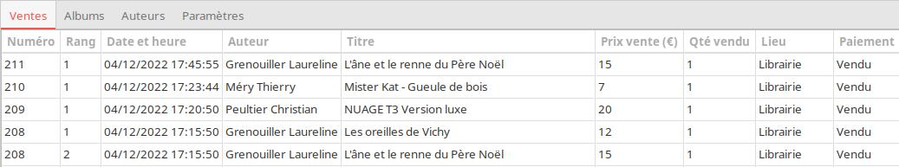
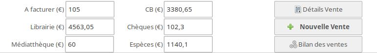
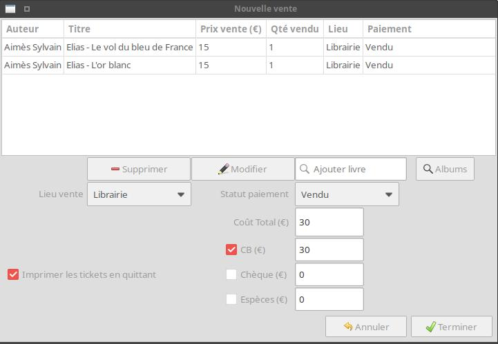
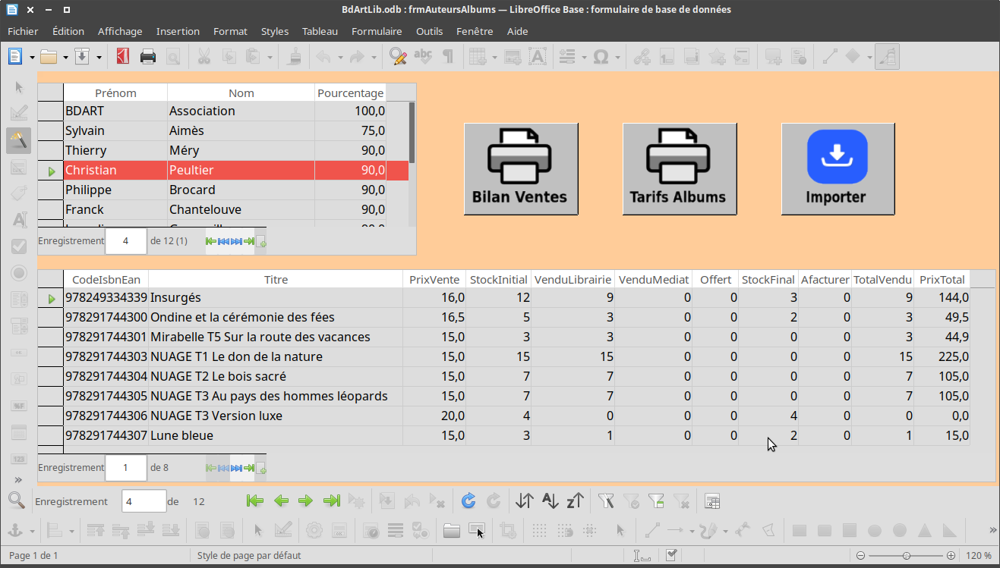

- [BdArtLibrairie](#bdartlibrairie)
  - [Présentation](#présentation)
  - [Principe de fonctionnement](#principe-de-fonctionnement)
    - [Filtre Auteur](#filtre-auteur)
    - [Recherche de livre](#recherche-de-livre)
  - [Onglet Auteurs](#onglet-auteurs)
    - [Modification ou suppression d'un auteur](#modification-ou-suppression-dun-auteur)
  - [Onglet Albums](#onglet-albums)
    - [Modification ou suppression d'un album](#modification-ou-suppression-dun-album)
    - [Impression des tarifs des albums](#impression-des-tarifs-des-albums)
  - [Onglet Ventes](#onglet-ventes)
    - [Effectuer une vente](#effectuer-une-vente)
    - [Modification ou suppression d'une vente](#modification-ou-suppression-dune-vente)
    - [Ré-impression des tickets](#ré-impression-des-tickets)
    - [Effacer toutes les ventes](#effacer-toutes-les-ventes)
    - [Bilan des ventes](#bilan-des-ventes)
    - [Sauvegarde des données](#sauvegarde-des-données)
    - [Impression des ventes par auteur](#impression-des-ventes-par-auteur)
  - [Onglet Paramètres](#onglet-paramètres)
  - [Structure des données](#structure-des-données)
  - [Développement et installation](#développement-et-installation)
  - [Notes de version](#notes-de-version)
  - [Téléchargements](#téléchargements)
  - [Installation sur Linux](#installation-sur-linux)

# BdArtLibrairie


## Présentation

Cette application a été créée pour gérer les ventes de la librairie tenue par des bénévoles lors du festival de bandes dessinées BD’Art de Rive de Gier (42800). Elle permet de réaliser les ventes en scannant les code-barres des albums, d'éditer des tickets de paiements, et de calculer les sommes à reverser aux auteurs en fin de festival.

Elle est composée de 4 onglets: _Ventes, Albums, Auteurs, Paramètres_.
Les données sont stockées dans 4 fichiers au format _csv_, séparateur _;_ (_Auteurs.csv_, _Albums.csv_, _Ventes.csv_ et _Paiements.csv_). Les fichiers sont stockés dans le dossier utilisateur, dans un dossier nommé _bdartlibrairie_ (cf. [onglet Paramètres](#onglet-paramètres))

## Principe de fonctionnement

Au lancement de l'application, si les fichiers _Auteurs.csv_ et _Albums.csv_ ne sont pas présents, ils sont automatiquement créés. Il faut ensuite ajouter un auteur avant de pouvoir ajouter ses albums.</br>
On peut utiliser le fichier de calcul _Modèle_librairie.ods_ dans un tableur pour d'abord créer la liste des auteurs puis la liste des albums, puis générer les fichiers _csv_.</br>
Pour cela, renseigner l'onglet _Auteurs_:


(dans la colonne Pourcentage, indiquer la part en % à reverser à l’auteur après les ventes)

puis l'onglet _Albums_:


**Important**: les chiffres de la colonne _IdAuteur_ de l’onglet _Albums_, doivent correspondre à ceux de la colonne _IdAuteur_ de l’onglet _Auteurs_.

- Si le fichier est ouvert dans **Google Sheet**, il faut l’exporter au format **Excel** ou **OpenDocument** (menu _Fichier → Télécharger_),
- Ouvrir le fichier dans **Excel** ou **LibreOffice Calc** puis exporter chacun des onglets dans un fichier _csv_ séparateur _;_ (dans **LibreOffice Calc**, faire pour chaque onglet : _Enregistrer sous_, choisir le format _Texte CSV_, puis choisir le séparateur _;_ ).

- Enregistrer les fichiers dans le dossier _bdartlibrairie_, chaque fichier porte le nom de l'onglet: _Auteurs.csv_, _Albums.csv_.

- Lancer l’application **BdArtLibrairie** (les fichiers sont chargés automatiquement) puis effectuer les ventes. (cf. § [Onglet Ventes](#onglet-ventes))

- Lorsqu’une vente d’albums est effectuée, les données sont automatiquement enregistrées dans les fichiers _Ventes.csv_ et _Paiements.csv_ et les cumuls en quantités et en euros sont recalculés pour chaque auteur.

- Par défaut, pour chaque vente, 2 tickets de caisse sont imprimés. On peut modifier ce choix dans l’ [onglet Paramètres](#onglet-paramètres).

### Filtre Auteur


Présent dans la partie inférieure de l’application, il permet de filtrer les données des onglets _Ventes_ et _Albums_ en fonction de l’auteur choisi.</br>
Le total vente (€) ainsi que la part auteur (€) sont aussi recalculés.</br>
La zone _% Auteur_ n’affiche une valeur que si un auteur est sélectionné.</br>
Le bouton _Reset_ annule tous les filtres.

### Recherche de livre

La zone _Recherche livre_ permet de retrouver les infos sur un livre en scannant son code-barres:


Certaines données sont modifiables, voir § [Modification ou suppression d'un album](#modification-ou-suppression-dun-album)

## Onglet Auteurs


On y retrouve les données du fichier _Auteurs.csv_.</br>
Il est possible d'ajouter, supprimer ou modifier un auteur via les boutons présents en bas:


### Modification ou suppression d'un auteur

Dans l'onglet _Auteurs_, sélectionner un auteur dans la grille.</br>
Pour supprimer un auteur, cliquer sur le bouton _Supprimer_. Un auteur ne peut pas être supprimé s'il possède des albums.

Pour modifier un auteur, menu _Affichage→Détails auteur sélectionné_, ou faire double-clic sur la ligne, ou cliquer sur le bouton _Détails_. Dans la boite de dialogue _Auteur_ cocher la case _Modifiable_:</br>


Seuls les champs _Prénom_, _Nom_ et _Part auteur_ sont modifiables.

## Onglet Albums


On y retrouve les données du fichier _Albums.csv_, la colonne _Auteur_ contenant le nom de l’auteur, remplace la colonne _IdAuteur_ du fichier. Les données sont calculées automatiquement après chaque vente.</br>
Dans la partie inférieure, on trouve les nombres de livres vendus en médiathèque, librairie, et les livres offerts.</br>


Il est possible d'ajouter, supprimer ou modifier un album via les boutons présents. Pour ajouter un album, il faut au préalable sélectionner son auteur dans la liste déroulante du filtre _Auteur_.</br>
On trouve également 2 filtres _Lieu vente_ et _A facturer_. Le contenu de la grille et les totaux sont adaptés en fonction des filtres (y compris le filtre _Auteur_).

### Modification ou suppression d'un album

Dans l'onglet _Albums_, sélectionner un album dans la grille.</br>
Pour supprimer un album, cliquer sur le bouton _Supprimer_.</br>
Un album ne peut pas être supprimé si des ventes de cet album sont enregistrées.

Pour modifier un album, menu _Affichage→Détails album sélectionné_, ou faire double-clic sur la ligne, ou cliquer sur le bouton _Détails_. Dans la boite de dialogue _Albums_ cocher la case _Modifiable_:</br>


Seuls les champs _Titre_, _Prix Vente_ et _Stock initial_ peuvent être modifiés.</br>
En cas de modification du prix de vente, si des ventes ont été enregistrées, un message indiquera les impacts sur les ventes, l'écart sera recalculé:


Ce message est enregistré dans le fichier _EcartsVentes.txt_, dans le dossier _bdartlibrairie_. Un bouton _Erreur écarts ventes_ apparait, permettant de réafficher les messages:


Pour supprimer ces messages, supprimer le fichier _EcartsVentes.txt_ à partir de la fenêtre qui s'ouvre en cliquant sur le bouton.

### Impression des tarifs des albums

Procéder comme décrit au § [Impression des ventes par auteur](#impression-des-ventes-par-auteur) pour générer le fichier d'export et lancer le fichier _BdArtLib.odb_.</br>
Cliquer sur le bouton _Tarifs des albums_, cela ouvrira le rapport contenant les tarifs par auteur:


## Onglet Ventes



La grille affiche la liste des ventes effectuées, triées par ordre décroissant (la dernière vente effectuée est affichée en haut de grille).
Le numéro et le rang de la vente sont affichés par défaut mais peuvent être masqués par le menu _Affichage→Toutes les colonnes_. Un rang correspond à un album.</br>
Dans la partie inférieure de l’onglet, on trouve des totaux, réactualisés en fonction du filtre _Auteur_, ainsi que des boutons d'action.



### Effectuer une vente

Cliquer sur le bouton _Nouvelle vente_.
Si la case _Ne pas imprimer les tickets_ est décochée dans les paramètres et si l’imprimante n’est pas montée correctement, un message d’erreur va s’afficher:


Cela n’empêche pas d’effectuer les ventes, mais l’impression des tickets ne sera pas possible. Cf § [Développement et installation](#développement-et-installation) pour installer l’imprimante.
Tant que l’imprimante ne sera pas reconnue, un rappel _L'imprimante n'est pas disponible_ sera affiché:


Le focus est placé sur la zone d’ajout de livre, il suffit de scanner les code-barres des livres, l’un après l’autre, pour les ajouter.
Sélectionner le lieu de vente et le statut de paiement avant d’ajouter un livre (sinon voir au § [Modification ou suppression d'une vente](#modification-ou-suppression-dune-vente) comment les modifier).



On peut aussi rechercher un livre en le sélectionnant dans la liste des albums, en cliquant sur le bouton _Albums_:


Filtrer par auteur et/ou saisir un mot du titre de l'album, puis sélectionner la ligne.
Faire un double-clic sur la ligne ou cliquer sur « OK » pour valider.
Le coût total est recalculé après l’ajout d’un livre.
Cocher ensuite le moyen de paiement, sinon un message d’erreur va s’afficher:


En cochant ou décochant un moyen de paiement, le montant du coût total s’affichera dans la zone correspondante, ou sera remis à 0.
Si plusieurs moyens de paiement sont cochés, il faut saisir les valeurs manuellement.
Le bouton _Annuler_ quitte la fenêtre après demande de confirmation si des livres ont été ajoutés.
Le bouton _Terminer_ imprime les tickets de caisse (sauf si la case _Imprimer les tickets en quittant_ est décoché) et enregistre la vente.


Si la case _Ne pas imprimer les tickets_ est cochée dans les paramètres, le ticket n’est pas imprimé mais seulement affiché dans une fenêtre:


Si les montants renseignés ne correspondent pas avec le coût total, un message d’erreur s’affichera:


Corriger les valeurs avant de continuer.

Si les stocks d'un ou plusieurs albums sont négatifs, un bouton _Erreur stock albums_ apparait:


Un clic sur ce bouton affiche la liste des albums concernés:


### Modification ou suppression d'une vente

Avant de terminer une vente, sélectionner une ligne de vente dans la grille en cliquant dessus:


Pour supprimer la ligne, cliquer sur _Supprimer_.
Pour modifier le lieu de vente et/ou le statut de paiement, sélectionner les valeurs dans les listes déroulantes, puis cliquer sur _Modifier_.

Pour modifier ou supprimer une vente enregistrée, sélectionner une ligne dans la grille des ventes:


puis menu _Affichage→Détails vente sélectionnée_, ou faire double-clic sur la ligne, ou cliquer sur le bouton _Détails vente_.
Cela affiche les détails de la vente. Pour passer en mode modification, cocher la case _Modifiable_:


Cela affichera les boutons de modifications et suppression.</br>
Pour supprimer la vente, supprimer chaque ligne une par une.</br>
Le numéro de vente ainsi que les date et heure de la vente initiale seront conservées en cas de modification.

### Ré-impression des tickets

Pour ré-imprimer les tickets de caisse, afficher les détails d'une vente (voir § [Modification ou suppression d'une vente](#modification-ou-suppression-dune-vente) ) et cliquer sur le bouton _Imprimer tickets_.

### Effacer toutes les ventes

Supprimer les fichiers _Ventes.csv_ et _Paiements.csv_ ou effacer les ventes par le menu _Fichier→RAZ des ventes_:


Après confirmation, saisir le mot de passe « Password01 » dans la zone sous la grille.
Si Ok, les fichiers _Ventes.csv_ et _Paiements.csv_ sont réinitialisés et le fichier _EcartsVentes.txt_ est supprimé.
Par sécurité, une copie de ces fichiers est sauvegardée dans le sous-dossier _Sauve_ du dossier _bdartlibrairie_ avec un numéro de version. Les fichiers de sauvegarde plus anciens sont conservés.

Vous pouvez également purger, après confirmation, ce dossier de sauvegarde via le menu _Fichier->Purger le dossier backup_

### Bilan des ventes

Le menu _Affichage->Bilan des ventes auteur_ ou un clic sur le bouton _Bilan des ventes_ affiche le classement des auteurs suivant 3 critères: le nombre d'albums vendus, le total des ventes (€) et la commission reversée à BD'Art (€):


### Sauvegarde des données

Les ventes sont enregistrées automatiquement. Seuls les fichiers _Ventes.csv_ et _Paiements.csv_ sont mis à jour après chaque vente.
Si on veut sauvegarder ces fichiers sur un autre support, on peut le faire manuellement via le gestionnaire de fichier, ou alors utiliser le menu _Fichier->Copier les fichiers sur clé_. Cette action va compresser le dossier _bdartlibrairie_ et le copier sur la clé USB. Voir l’ [onglet Paramètres](#onglet-paramètres) pour configurer le montage de la clé USB.

### Impression des ventes par auteur

Deux méthodes possibles:

- soit faire une copie d'écran de l'onglet _Albums_ pour chaque auteur sélectionné dans la liste auteurs, puis imprimer la copie d'écran (via **Firefox** par exemple).

- soit par le menu _Fichier->Exporter fichier Albums_. Un nouveau fichier texte _csv_ sera créé et il contiendra les albums de tous les auteurs, ou seulement ceux de l'auteur sélectionné dans le filtre auteurs. Le nom du fichier est:
```Albums_export.csv```</BR>
Ce fichier comporte des champs supplémentaires permettant d'en exploiter les données dans un tableur, avec un tableau croisé dynamique.</br>
A la fin de l'export, si coché dans les paramètres, **LibreOffice Base** est lancé et la base de donnée _BdArtLib.odb_ est chargée et ouverte sur un formulaire</BR>
L'import des fichiers est réalisé automatiquement et un message confirme qu'il a bien été effectué:




- Les tables sont remplies automatiquement avec les contenus des fichiers _Auteurs.csv_ et _Albums_export.csv_.
- Cliquer ensuite sur le bouton _Bilan des ventes_. Cela va ouvrir le rapport, classé par auteurs, qu'il ne reste plus qu'à imprimer:


## Onglet Paramètres


Cet onglet permet de modifier certains paramètres:

- le point de montage sous Linux de l’imprimante thermique: _dev/usb/lp1_ par défaut (cf. § [Développement et installation](#développement-et-installation) pour explications).
- le point de montage sous Linux de la clé USB: _/media/rafbor/4429-4124_ par défaut (cf. § [Développement et installation](#développement-et-installation) pour explications).
- le nombre de tickets à imprimer : 1 à 3 (défaut : 2).
- la temporisation pendant l’impression : 0 à 5000 ms (défaut : 2000). Ce paramètre suspend le thread courant de l’application pendant l’impression des tickets. Une valeur trop petite entraînera l’arrêt de l’impression en cours avant qu’elle soit terminée.
- l’utilisation ou pas de l’imprimante à tickets. Si coché, le ticket sera affiché dans une fenêtre et ne sera pas imprimé.
- l'ouverture ou pas du fichier, après l'export du fichier albums, **LibreOffice Base** _Bdartlib.odb_ pour imprimer les ventes par auteur.
- renseigner le nom du festival qui apparaitra dans la barre de titre de l'application et dans les tickets.
- la part auteur par défaut, en %.
- l'application des styles CSS pour colorier les Widgets d'affichage et de saisie de texte. Décocher si les couleurs ne sont pas compatibles avec le thème utilisé.
- les dimensions en pixel de la fenêtre des ventes (720x470 mini - 1000x700 maxi).

Ces paramètres sont prédéfinis dans le fichier de configuration de l'application _app.config_ qui est stocké dans le dossier _bdartlibrairie_ du dossier utilisateur. Ils sont mis à jour à la fermeture de l'application.

```text
<userSettings>
    <PrinterFilePath value="/dev/usb/lp0" />
    <Tempo value="2000" />
    <NombreTickets value="2" />
    <AppliquerCss value="True" />
    <UseDialogForTicketPrint value="True" />
    <UsbDevicePath value="/media/raf/4429-4124" />
    <NomFestival value="BD'Art" />
    <LaunchBaseFile value="False" />
    <PartAuteurDefaut value="90" />
  </userSettings>
```

L'onglet affiche aussi le chemin vers le dossier _bdartlibrairie_ ou sont stockés les fichiers. Le chemin est différent selon le format de l'application installée (ce paramètre n'est pas modifiable): 
- Format _AppImage_: $HOME/.config/bdartlibrairie
- Format _Snap_: $HOME/snap/bdartlibrairie/common/bdartlibrairie

## Structure des données

Auteurs.csv
| Champ | Type |
| ----- | ----- |
| IdAuteur | Int16 |
| Auteur | String |
| Pourcentage | Double |

Albums.csv
| Champ | Type |
| ----- | ----- |
| Code ISBN / EAN | String |
| IdAuteur | Int16 |
| Titre | String |
| Prix vente | Double |
| Stock initial | Int16 |
| Vendu Librairie | Int16 |
| Vendu Médiat. | Int16 |
| Offert | Int16 |
| Stock final | Int16 |
| A facturer | Int16 |
| Total vendu | Int16 |
| Prix total | Double |

Ventes.csv
| Champ | Type |
| ----- | ----- |
| Numéro | Int16 |
| Rang | Int16 |
| Date | DateTime |
| Code ISBN / EAN | String |
| Quantité | Int16 |
| Lieu | String |
| Paiement | String |

Paiements.csv
| Champ | Type |
| ----- | ----- |
| NuméroVente | Int16 |
| PourcentCB | Double |
| PourcentChèque | Double |
| PourcentEspèces | Double |

## Développement et installation

En pratique, pendant le festival BD'Art, un PC sous Xubuntu 22.04 est utilisé, sur lequel est connecté une imprimante Epson TM-T20III et un lecteur de code-barres TERA T5100C.

L’application est développée en C# avec _Visual Studio Code_ sur PC Ubuntu, elle utilise les frameworks _.NET 8_ et _Gtk3_ via la librairie [GtkSharp](https://github.com/GtkSharp/GtkSharp).

_Gtk3_ est installé par défaut sur les systèmes Linux Ubuntu et Xubuntu.
Pour utilisation sur système Windows, il faut installer _Gtk3_.

La publication pour Linux de l’application dans _Visual Studio Code_ se fait au format _AppImage_, en lançant le script _publish-appimage_ (cf [Publish-AppImage](https://github.com/kuiperzone/Publish-AppImage) pour explications sur la configuration et l'utilisation). Le fichier _AppImage_ généré intègre le _Runtime .NET 8_ et se trouve dans le dossier _AppImages_.

Consulter la [documentation Microsoft](https://learn.microsoft.com/fr-fr/dotnet/core/deploying/) pour plus d'explications sur le déploiement d'applications _.NET_.

Les données sont stockées dans les fichiers _csv_ décrits au § [Présentation](#présentation), l’application n’utilise pas de  base de données pour stocker les données, seulement **LibreOffice Base** pour générer les rapports de ventes par auteurs.
Le fichier base _BdArtLib.odb_ doit être présent dans le dossier _bdartlibrairie_, s'il n'est pas présent au lancement de l'application, l'application tente de le télécharger depuis le dépôt Github.

Pour l’impression des tickets de caisse, on utilise le protocole ESC/POS développé par Epson. L’imprimante thermique TM-T20III est donc parfaitement adaptée.
L’application utilise le package [ESC-POS_NET](https://github.com/lukevp/ESC-POS-.NET) pour imprimer.
Le fichier _readme_ du dépôt Git explique que le protocole ESC/POS ne nécessite pas d’installer un driver, il suffit de connecter l’imprimante en USB pour qu’elle soit utilisable.
Sur Linux, l’imprimante est accessible par _/dev/usb/lp1_. Pour vérifier son fonctionnement, aller dans l’onglet _Paramètres_, cliquer sur le bouton _Rechercher_:


l’imprimante doit apparaître sous le nom de périphérique _lp0_, _lp1_ ou _lp2_.</br>
Si différent de _lp1_ (valeur par défaut), modifier la valeur dans la zone suivante:


Faire un test d’impression à partir de l’onglet _Ventes_ ou rentrer via le terminal:

```echo "Hello" >> /dev/usb/lp1```

Si message d’erreur _Permission denied_, il faut ajouter le username dans le groupe _lp_

```sudo usermod -a -G lp username```

Fermer puis rouvrir la session pour que le changement soit effectif.
Cf. [Mike's Software Blog](https://mike42.me/blog/2015-03-getting-a-usb-receipt-printer-working-on-linux) pour plus d’explications.

Sur Windows, cf. les explications du fichier _readme_ du dépot [ESC-POS_NET](https://github.com/lukevp/ESC-POS-.NET), il faut installer un port COM virtuel, et mapper l’imprimante sur ce port, ou alors utiliser un câble USB-Serie en utilisant le port série de l’imprimante.

Pour l'accès à la clé USB sur Linux, on recherche dans le fichier _/proc/mounts_ les lignes commençants par "dev/sd". Cliquer sur le bouton _Rechercher_ pour lancer la recherche.</br>
Modifier la valeur dans la zone texte correspondante pour mettre à jour le point de montage qui apparait par défaut.

## Notes de version

- **3.1.0515.0**
  - Ajout fichiers _.desktop_ et _.png_ dans dossier _snap/gui_ afin que l'installation du _Snap_ crée un lanceur.
  - Mise à jour du fichier _readme_ pour intégrer la version _Snap_.
  - Modifié dossier de stockage des fichiers et de la configuration, affichage du chemin dans les paramètres.
  - Modifications mineures.

- **3.1.0416.0**
  - Modifications mineures afin de pouvoir générer et faire fonctionner un paquet _Snap_.

- **3.1.0112.0**
  - Ajout possibilité de modifier et stocker les dimensions (en pixels) de la fenêtre des ventes.
  - Application des styles CSS aux listes déroulantes pour mettre en évidence les filtres actifs.
  - Réécriture du code d'application des styles CSS.
  - Lors de l'export des albums, les fichiers sont importés automatiquement dans les tables de _BdArtLib.odb_.
  - Corrections mineures.

- **3.1.0107.0**
  - Ajout possibilité de supprimer le fichier _EcartsVentes.txt_.
  - Ajout possibilité de purger le dossier de sauvegarde des fichiers.
  - Utilisation des styles CSS sur les Widgets d'affichage et de saisie de texte.

- **3.0.1228.0**
  - On lance BdArtLib.odb seulement si coché dans les paramètres.
  - Nom du festival modifiable dans les paramètres: affiché dans titre de l'appli et dans les tickets.
  - Ajout de champs dans l'export albums pour exploitation directe dans un tableur.
  - Ajout menu pour recharger les fichiers sans quitter le programme.
  - Ajout possibilité d'ajouter, supprimer un auteur et modifier les données auteur.
  - Ajout possibilité d'ajouter, supprimer un album et modifier des données pour les albums.
  - Ajout contrôle et sauvegarde des répercussions lors du changement du prix d'un album.
  - Au lancement de l'application, tout fichier d'entrée non trouvé est créé.
  - Les fichiers Ventes et Paiements vides ne sont plus nécessaires.
  - Ajout possibilité de modifier et supprimer les données d'une vente.
  - Lors de l'export du fichier albums, si un auteur est sélectionné, seuls les albums de cet auteur sont exportés.
  - Macro de BdArtLib.odb entièrement réécrite.
- **2.0.0306.0**
  - Au lancement et si non trouvé, le fichier _BdArtLib.odb_ est téléchargé à partir du dépôt Github.
- **2.0.0304.0**
  - Publication sous forme d'_AppImage_.
  - Suppression du script _findusb.sh_.
- **2.0.0210.0**
  - Les données et la config utilisateur ne sont plus stockées dans le dossier de l'application mais dans le dossier utilisateur afin de faciliter l'installation des nouvelles versions.
  - Modifié export des fichiers afin de pouvoir les importer dans les tables de la base de données _BdArtLib.odb_ pour générer les rapports.
  - Le menu _Fichier->Exporter fichier albums_ ouvre directement la base de données après l'export.
  - Inversion affichage du nom/prénom des auteurs.
- **1.0.1212.1**</br>
  - Onglet Ventes: affichage par défaut des colonnes _Numéro_ et _Rang_.
  - Ajout de la fenêtre d'affichage des statistiques de ventes.
  - Mise à jour du fichier _Readme_ incluant l'ajout des notes de versions.
- **1.0.1110.0**
    Première version publiée.

## Téléchargements

- **Linux**:
  - Fichier _AppImage_: voir [Releases](https://github.com/Rafbor42/BdArtLibrairie/releases).

## Installation sur Linux

- Format _AppImage_: consulter cette [documentation](https://doc.ubuntu-fr.org/appimage) pour savoir comment installer des fichiers _AppImage_.
- Format _Snap_: **BdArtLibrairie** peut être installée de différentes manières:
  - à partir du [Snap Store en ligne](https://snapcraft.io/bdartlibrairie).
  - à partir de votre gestionnaire de logiciels (Gnome Software, Snap Store, Discover,...).
  - en ligne de commande:</br>
  ```sudo snap install bdartlibrairie```

  Après installation du _Snap_, pour autoriser les téléchargements de fichiers, l'accès aux périphériques USB ainsi que l'impression des tickets sur l'imprimante thermique, lancer les commandes suivantes:</br>
  ```sudo snap connect bdartlibrairie:removable-media```</br>
  ```sudo snap connect bdartlibrairie:mount-observe```</br>
  ```sudo snap connect bdartlibrairie:raw-usb```</br>
